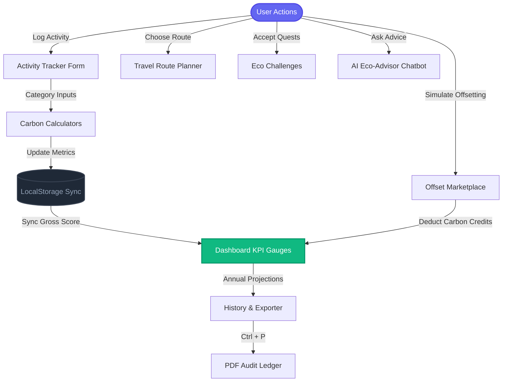

# 🌲 EcoSphere: Carbon Footprint Tracker & Reduction Advisor

> ### 🌐 [Live Web App on Google Cloud Platform](https://ecosphere-rajukanna.storage.googleapis.com/index.html)

EcoSphere is a premium, high-fidelity single-page web application built with **React, TypeScript, and Vite**. It empowers individuals to calculate, analyze, and offset their personal carbon footprints through actionable insights, gamified challenges, and an interactive travel route planner.

---

## 🚀 Key Features

*   📊 **Interactive Carbon KPI Gauges**: Real-time monthly calculations of transport, home energy, food diet, and waste carbon metrics relative to the Paris Agreement target (167 kg CO₂/month).
*   🚙 **Transit Route Planner**: Compare carbon emission profiles between passenger vehicles, hybrid cars, electric cars (EVs), public transport, aviation corridors, and active transit (cycling/walking) side-by-side.
*   🍃 **Offset Project Marketplace**: Support simulated certified offset initiatives (Amazon reforestation, blue carbon mangrove propagation, wind energy grids, landfill methane capture) to offset emissions to zero and achieve "Carbon Neutral" status.
*   💬 **AI Eco-Advisor Chatbot**: Interactive client-side environmental assistant providing customized recommendations for waste management, home electricity audits, and eco-friendly shopping.
*   🏆 **Climate Action Challenges**: Gamified habit trackers where users accept and log eco-challenges (e.g. Plant-Powered Week, Cold-Water wash) to deduct CO₂ points from their footprints.
*   📄 **PDF Exporter & Ledger**: Dedicated layout stylesheet optimized for printing (`Ctrl + P`) or exporting to PDF to generate a formal personal Carbon Audit certificate.

---

## 📐 Carbon Calculation Models

Emissions are computed dynamically in **kg CO₂ / month** based on localized environmental agency factors:

| Category | Parameter | Emission Factor / Calculation |
| :--- | :--- | :--- |
| **Transportation** | Vehicle Driving | Petrol: `0.20 kg/km`, Diesel: `0.18 kg/km`, Hybrid: `0.10 kg/km`, Electric (EV): `0.04 kg/km` |
| | Public Transport | Bus / Train: `0.04 kg/km` |
| | Aviation | Flights: `150 kg / flight hour` (distributed monthly) |
| **Home Energy** | Grid Electricity | `0.38 kg/kWh` (reduced by Clean Energy Tariff Share percentage) |
| | Natural Gas | `0.185 kg/kWh` |
| **Diet & Food** | Diet Type base | Heavy Meat: `210 kg/mo`, Medium Meat: `142 kg/mo`, Veg: `80 kg/mo`, Vegan: `40 kg/mo` |
| | Food Miles / Waste | Deducts up to `15%` for local sourcing; adds `10-25 kg` penalty for high food wastage |
| **Waste** | Household Trash | `1.5 kg CO₂` per kg of trash; credits up to `40%` for recycling; `15%` credit for composting |

---

## 🔄 Application Architecture Flow

The following diagram visualizes how user actions, calculations, persistence, and reports coordinate inside the **EcoSphere** engine:



---

## 🛠️ Installation & Local Setup

### System Prerequisites
Ensure you have **Node.js** (v18+) and **npm** installed on your machine.

1.  **Clone the Repository**:
    ```bash
    git clone https://github.com/rajukanna/ecosphere-carbon-tracker.git
    cd ecosphere-carbon-tracker
    ```

2.  **Install Dependencies**:
    ```bash
    npm install
    ```

3.  **Start Development Server**:
    ```bash
    npm run dev
    ```
    Open **[http://localhost:5173](http://localhost:5173)** in your browser to view the application.

4.  **Build for Production**:
    ```bash
    npm run build
    ```

---

## ☁️ Google Cloud Platform (GCP) Deployment

This application includes configuration files for containerized static web serving.

### Option A: Static Web Server (Google Cloud Storage)
Because the app runs fully client-side without a custom database server, hosting it from GCS is fast and cost-free:
1. Create a bucket: `gcloud storage buckets create gs://YOUR_BUCKET_NAME`
2. Upload assets: `gcloud storage cp -r dist/* gs://YOUR_BUCKET_NAME/`
3. Bind public reading: `gcloud storage buckets add-iam-policy-binding gs://YOUR_BUCKET_NAME --member=allUsers --role=roles/storage.objectViewer`
4. Set main page suffix: `gcloud storage buckets update gs://YOUR_BUCKET_NAME --web-main-page-suffix=index.html`

### Option B: Cloud Run Container
The workspace contains a `Dockerfile` and `nginx.conf` designed to build and deploy an Alpine-Nginx container on port `8080` in Cloud Run.
```bash
gcloud run deploy ecosphere --source . --region us-central1 --allow-unauthenticated
```

---

## 📝 License
This project is licensed under the MIT License - see the LICENSE file for details.
